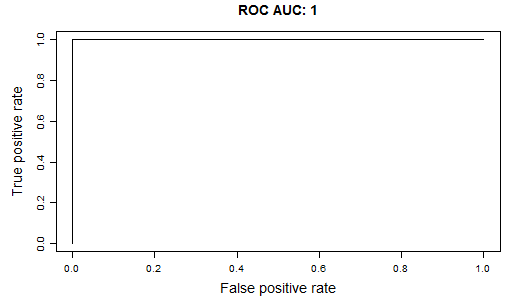

# BiomarkerViewer

##  An application for the visual analysis of biomarkers in transcriptomic data

**BiomarkerViewer** is a friendly user interface for the visual interpretation of biomarkers. We visualize the prediction scores using density plots, and evaluate the performance based on the Area Under the Receiver Operator Curve (ROC AUC). The mean AUC is summarized using boxplots across different feature filters, feature selection methods, biomarker sizes and prediction models. BiomarkerViewer is developed in **R**, and requires R to be installed.

To run BiomarkerViewer, first install the latest available version of the following R packages:

* shiny
* DT
* pROC
* ROCR
* markdown
* gplots
* shinyjs

Then, execute the file *runBiomarkerViewer.bat*.

BiomarkerViewer consists of five main panels. The first panel (*Prediction Scores*) shows all tested biomarkers sorted by the AUC in descending order. Each model can be selected from a drop-down menu and a slide bar.

This panel consists of four plots: the distribution of test samples per prediction score and the Area Under the Receiver Operator Curve (ROC AUC) of the selected classification model. These plots are displayed for both real and random data.

| Density plot | ROC AUC plot |
| ------------ | -------- |
| ||

The second panel (*Model selection*) displays the performance of the models for each biomarker discovery step. 

*Model selection* contains boxplots that summarize the mean AUC across different groups of models. The top significant groups of models are highlighted in red.

The model statistics (top) and the results from the Tukey test used to discriminate the best groups (bottom) are shown below.

The third panel (*Random mean AUC*) compares the performance of the models for the real and random data displaying boxplots that summarize the mean AUC across different groups of models.

| AUC for real data |
| ------------ |
| |

| AUC for random data |
| ------------ |
||

The four panel (*View biomarker*) displays a heatmap of a biomarker. Each expression file must be uploaded separately, as well as a file with the features and samples to filter. These files (*feature_names* and *predictions*) are generated by the pipeline under the folder with the number of the selected model.

| Heatmap | ROC Curve of the biomarker |
| ------------ | ------------ |
| | |

The fifth panel (*Heatmap*) displays a heatmap of a biomarker without filtering the features and samples. 
